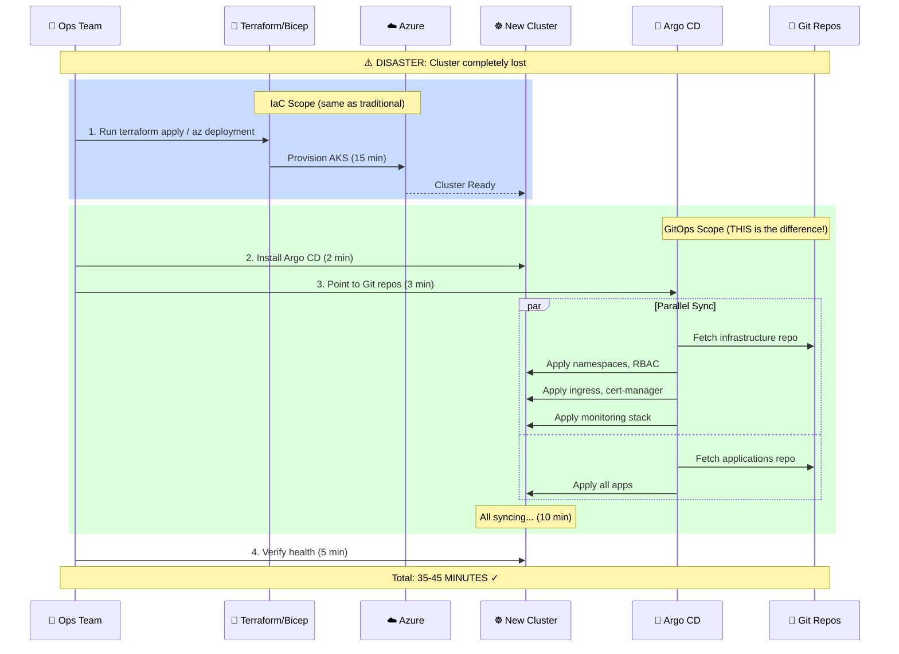

```mermaid
sequenceDiagram
    participant Ops as 👷 Ops Team
    participant IaC as 📜 Terraform/Bicep
    participant Azure as ☁️ Azure
    participant K8s as ☸️ New Cluster
    participant Argo as 🔄 Argo CD
    participant Git as 📁 Git Repos

    Note over Ops,Git: ⚠️ DISASTER: Cluster completely lost

    rect rgb(200, 220, 255)
        Note over IaC,Azure: IaC Scope (same as traditional)
        Ops->>IaC: 1. Run terraform apply / az deployment
        IaC->>Azure: Provision AKS (15 min)
        Azure-->>K8s: Cluster Ready
    end
    
    rect rgb(220, 255, 220)
        Note over Argo,Git: GitOps Scope (THIS is the difference!)
        Ops->>K8s: 2. Install Argo CD (2 min)
        Ops->>Argo: 3. Point to Git repos (3 min)
        
        par Parallel Sync
            Argo->>Git: Fetch infrastructure repo
            Argo->>K8s: Apply namespaces, RBAC
            Argo->>K8s: Apply ingress, cert-manager
            Argo->>K8s: Apply monitoring stack
        and
            Argo->>Git: Fetch applications repo
            Argo->>K8s: Apply all apps
        end
        
        Note over K8s: All syncing... (10 min)
    end
    
    Ops->>K8s: 4. Verify health (5 min)
    
    Note over Ops,Git: Total: 35-45 MINUTES ✓
```
